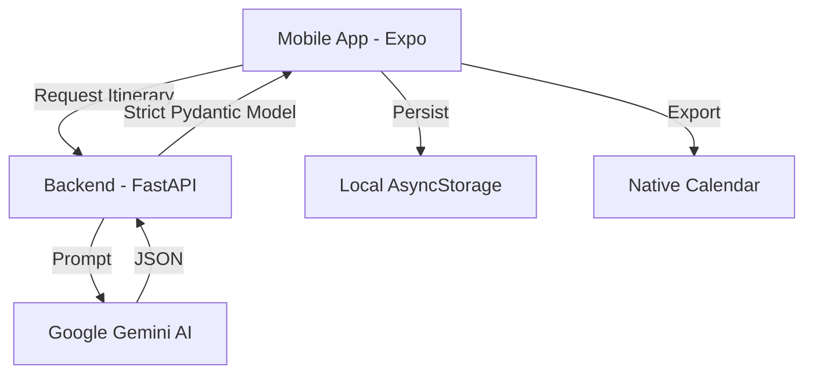

# DriftStar

DriftStar is an AI-powered travel assistant that creates personalized, high-fidelity itineraries. Built with a focus on premium aesthetics, fluid animations, and robust native integration.

## 🚀 Technology Stack

### Frontend (Mobile App)
The frontend is built with **Expo (React Native)** using the modern **Expo Router** for file-based navigation.

*   **State Management**: **MVVM (Model-View-ViewModel)** pattern using **Native React Hooks**.
    *   *Technology:* Pure `useState`, `useReducer`, `useMemo`, and `useCallback` encapsulated in custom ViewModels.
    *   *Why?* Keeps the app lightweight and high-performance without the boilerplate of Redux or the overhead of Zustand for this scale of data. Separates business logic from UI components (Views), making the app easier to test and maintain.
*   **Animations**: **React Native Reanimated**.
    *   *Why?* Enables 60fps animations by running them on the native thread. Used for the Parallax headers and fluid step transitions.
*   **Local Persistence**: **AsyncStorage**.
    *   *Why?* Handles lightning-fast local saving of generated trips, ensuring offline availability of itineraries.
*   **Styling**: Custom **Design System** using shared tokens (`colors.ts`).
    *   *Philosophy:* Focus on premium aesthetics using glassmorphism (`expo-blur`), smooth gradients (`expo-linear-gradient`), and high-quality image rendering (`expo-image`).
*   **Native Features**: 
    *   **Expo Calendar**: Direct integration to export generated trips to the user's system calendar.
    *   **Expo Haptics**: Tactile feedback for every button tap.

### Backend (AI Engine)
A high-performance Python backend that serves as the brain of DriftStar.

*   **Framework**: **FastAPI**.
    *   *Why?* Extremely fast and uses asynchronous Python for high concurrency.
*   **AI Engine**: **Google Gemini (google-genai)**.
    *   *Why?* Used for deep, contextual itinerary generation and intelligent destination analysis.
*   **Validation**: **Pydantic**.
    *   *Why?* Ensures strict data integrity for the complex itinerary structures exchanged between the AI and the mobile app.

## 🏗️ Architecture

## 🎨 Design Philosophy
DriftStar follows a **Warm-Premium** aesthetic:
- **Palette**: Earthy neutrals paired with a rich **Terracotta** accent.
- **Motion**: Every change is directional. Screens slide with momentum-based physics (Springs).
- **Depth**: Extensive use of tiered shadows and glass overlays to create a layered "magazine" feel.

## 🛠️ Key Services
- **StorageService**: Manages the local persistence and synchronization of trip data.
- **CalendarService**: Handles the complex permission flows and event creation for iOS/Android calendars.
- **ApiService**: Encapsulates all network logic with robust typing and error handling.
